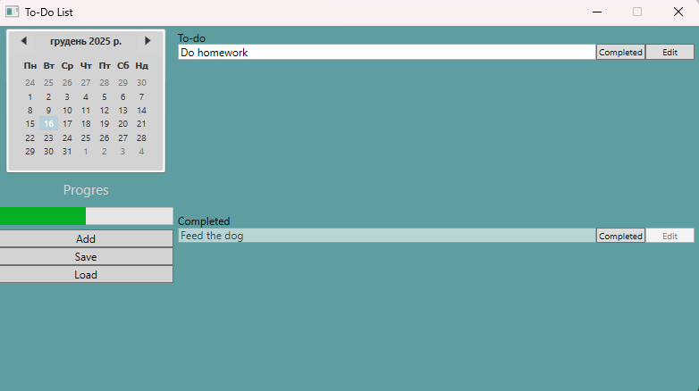

# WPF To-Do List Application

This project is a simple **To-Do List desktop application** built using **WPF**.  
It helps users manage daily tasks in a clear and structured way.

## Description

The application provides a calendar-based interface that allows users to organize tasks by date.  
Tasks can be added, edited, marked as completed, and displayed in a separate completed section.

## Key Features
- Calendar for selecting dates
- Task list with editable task names
- Ability to mark tasks as completed
- Separate section for completed tasks
- Progress indicator
- Buttons to add, save, and load tasks
- Clean and minimal user interface

## Purpose

This project was created to practice WPF fundamentals such as UI layout, event handling, and basic data management.  
It can serve as a foundation for more advanced task management applications.
